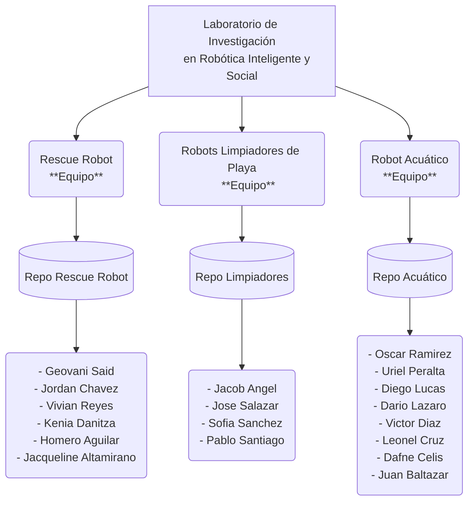

## Laboratorio de Investigación en Robótica Inteligente y Social

```mermaid
---
config:
  flowchart:
    htmlLabels: false
---
flowchart TD
    A["Laboratorio de Investigación
    en Robótica Inteligente y Social"]

    A-->B("Rescue Robot
    **Equipo**")
    A-->C("Robots Limpiadores de Playa
    **Equipo**")
    A-->D("Robot Acuático
    **Equipo**")

    B-->J[(Repo Rescue Robot)]-->F("
    - Geovani Said
    - Jordan Chavez
    - Vivian Reyes
    - Kenia Danitza
    - Homero Aguilar
    - Jacqueline Altamirano
    ")

    C-->K[(Repo Limpiadores)]-->G("
    - Jacob Angel
    - Jose Salazar
    - Sofia Sanchez
    - Pablo Santiago
    ")

    D-->L[(Repo Acuático)]-->H("
    - Oscar Ramirez
    - Uriel Peralta
    - Diego Lucas
    - Dario Lazaro
    - Victor Diaz
    - Leonel Cruz
    - Dafne Celis
    - Juan Baltazar
    ")
```
